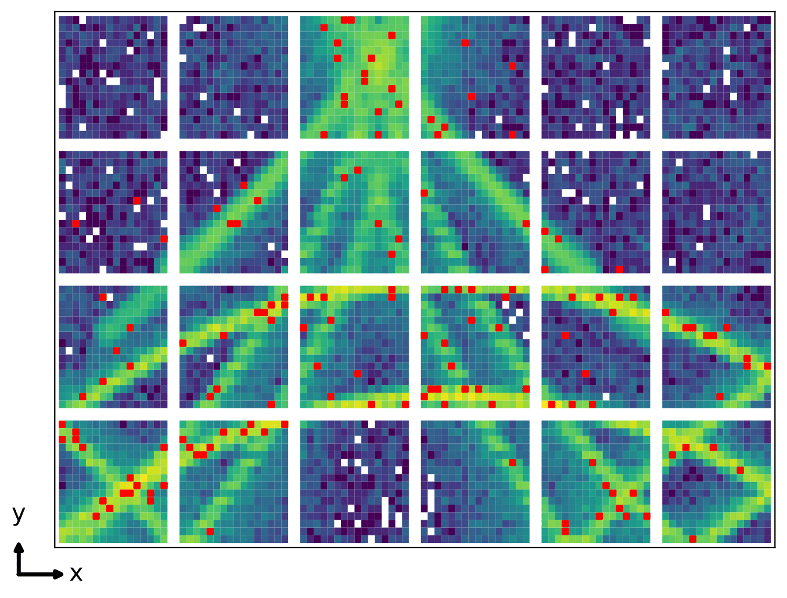
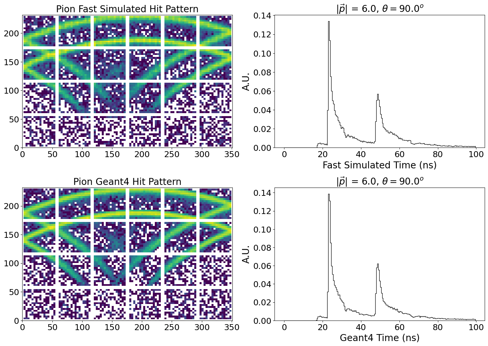
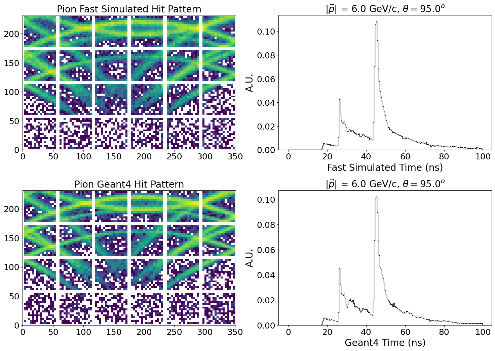
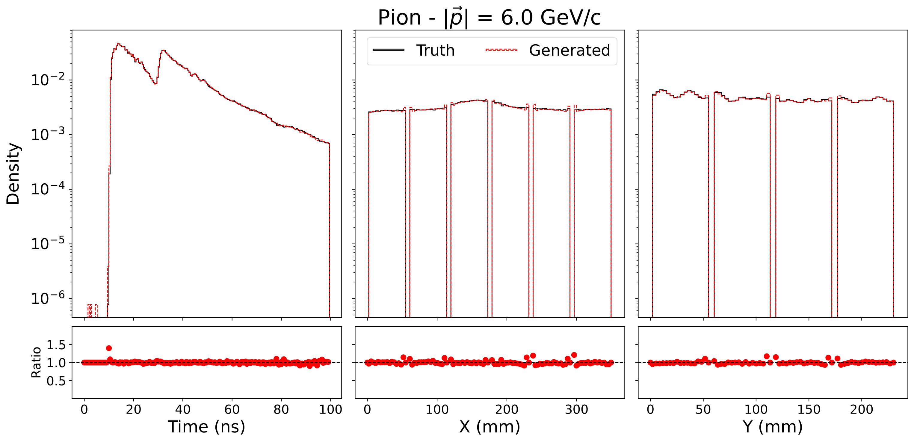
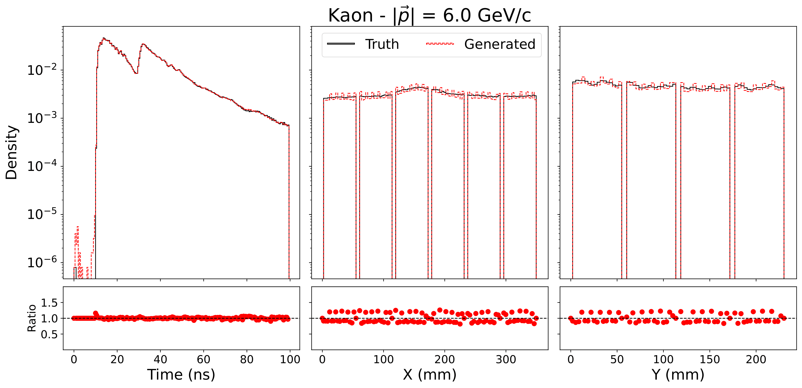

# Fast Simulation for the hpDIRC



This repository contains all the necessary files for running the hpDIRC fast simulation. I've organized them in a way that should be easy to modify and generate new simulations based on your needs.

Note: The generations will not be performed bar-by-bar, but at fixed regions of momentum and theta. We are using two conditionals for the simulation, as it is set up with $\phi = 0$. This setup should be fine for now, and we can make use of symmetry arguments..

### **What You Will Need (Updated Jan 18, 2025):**

1. **The Config File**  
   The config file contains crucial information such as scalings, data paths, and other settings. I will provide access to this file on the cluster. The hpDIRC_config_gulf.json file should give you all the paths you need. You should structure your config file like the hpDIRC_config_clean.json file. You will see how each model has different parameters / fields.

2. **The Models (Freia)**  
   The models contain variables such as `allowed_x`, `allowed_y`, etc., that are used for masking and resampling operations.

3. **The `gen_thetas_hpDIRC` Shell Command**  
   I have provided three versions of the `gen_thetas_hpDIRC` shell command:
   - On the cluster, use the `.csh` or `.sh` file depending on whether you're using `tcsh` or `bash`.
   - On Windows, use the `.bat` file.

4. **Training Files for your models**
   You training files should remain the same, but now you will want to update them to index specific thing, i.e., batch_size_SDE, etc. You will need to put this into the CreateLoaders(args,model_type="SDE") to have it index correctly. You will also want to do things like num_layers = config["model_SDE"]["num_layers"]. You can hardcode these things in the specific training file. See the provided training scripts for examples of what I mean. Also an important note **TRAINING ON LINUX YOU CAN USE MULTIPLE WORKERS** - see dataloader.py and set it to say 8 or 12 depending on CPU requested.

5. **Generation python script**
   I have made it so that you can dynamically index the model type through the .sh or .tcsh scripts. Within the generate_fixedpoint_hpDIRC.py file, you will need to import your models (put them in a folder in the models folder), and then add an elif statement to check. See how I am currently doing this and match the scheme.

6. **torch_linux.yml**
   You can replicate this env by doing:
   ```bash
   conda env create -f torch_linux.yml 
   ```
   Build needed packages into this. Its running with latest cuda, pytorch etc.


<div style="display: flex; justify-content: space-between;">
    
    
</div>

---

### **Training Resources (Updated Jan 18, 2025)**

Below Im including the resources you will need for training (in terms of what to request from the cluster). Note as you install things in your miniforge env you may need to increase cpu by 1 or 2:

```bash
#!/bin/bash
#SBATCH --export=ALL
#SBATCH --job-name=FlowMatch
#SBATCH --nodes=1
#SBATCH --tasks=20
#SBATCH --mem-per-cpu=4000
#SBATCH --gpus=1
#SBATCH -t 65:00:00


cd $SLURM_SUBMIT_DIR

module load miniforge3/24.9.2-0
module load cuda/12.4
source activate torch_linux

python /sciclone/home/jgiroux/Cherenkov_FastSim/train_flow_matching.py --config /sciclone/home/jgiroux/Cherenkov_FastSim/config/hpDIRC_config.json 

```

### **Using the `.sh` / `.tcsh` Files for Generation (Updated Jan 22, 2025)**

An important thing to note is that if you make a change in the .tcsh or .sh files, you need to recompile them as executables. Theta will loop in these automatically, but you will need to go in and change the momentum values. You will also need to specifcy which model type you want to generate (currently have NF, CNF, FlowMatching - this is WIP.)

```bash
chmod +x gen_thetas_hpDIRC.sh
```

The momentum will index specific files (in the fixed_point datasets field) and generate the full theta range at that momentum. Then you can simply do:

```bash
./gen_thetas_hpDIRC.sh 
```

In the config file (also please feel free to remove all the model paths I have in there) you will see the Inference/fixed_point_dir field. You will need to change this to whatever you want. I recommend having something that gives information of the model, and also the momentum range, e.g., SDE_V1_6GeV. This will create a folder called Generations (only once), along with another folder with the name you have given in that fixed_point_dir field. Here it will dump the generations and ground truth into .pkl files, loop over these .pkl files and create individual .png images, and then combine these into a single .pdf. These images will be inside a folder called Plots.

I have included code for quantitative assessment of the fast simulations. This is included in the make_plots.py file and will run when you execture one of the batch scripts. It will produce the ratio plots below, along with printing you some metrics, i.e., the weighted average ratio and the weighted devation from 1 (RMS). These can be beautified later on, but give us a measure of performance. Note these run at a specific momentum, and integrate over theta.


<div align="center">
  
</div>

---

<div align="center">
  
</div>

## Pions
**Ratios:**
- **X:** 1.0197396402854462  
- **Y:** 1.0186972537101524  
- **Time:** 1.0004018114406121  

**RMS:**
- **RMS X:** 0.14630745458616642  
- **RMS Y:** 0.14238202323044372  
- **RMS Time:** 0.02029495644844653  

---

## Kaons
**Ratios:**
- **X:** 1.0208054115024188  
- **Y:** 1.0196786662200525  
- **Time:** 1.0004422737339618  

**RMS:**
- **RMS X:** 0.14981686869362465  
- **RMS Y:** 0.14590069612117637  
- **RMS Time:** 0.022045840144454147


### **Creating your own simulation**
This is more complicated. I don't think you should need to do it so I am going to save myself from detailing this but we can talk about it if you wish. Probably easier for me to run it for you.


